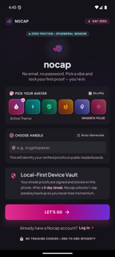
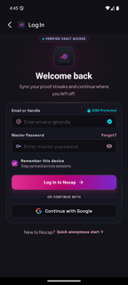
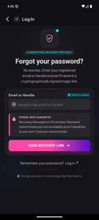
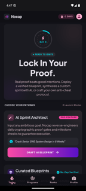
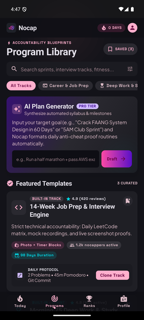
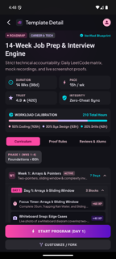
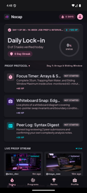
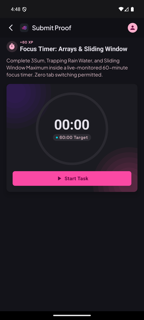
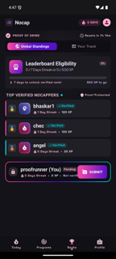
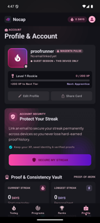

# Nocap

**A proof-based consistency app.** Not another checkbox habit tracker — you don't get to
tick a box and call it done. You back every day up with real proof (a monitored focus
timer, a photo, or an honest self-check), and only a fully-verified day extends your
streak. Build enough of a streak and you unlock a public leaderboard where everyone
ranked has done the same.

Built with React Native (Expo) + Supabase.

---

## What it actually looks like

### Getting in — no email, no password

You're in the app in about ten seconds. Supabase signs the device in anonymously, a DB
trigger creates your profile, and you pick a vibe + handle. Returning users can log in
instead, with a magic-link recovery path if they've lost the password.

| Welcome (anonymous start) | Returning user login | Password recovery |
|---|---|---|
|  |  |  |

The handle field checks availability live against the DB as you type, and validates
length/characters before it ever hits the network.

### Picking something to be accountable to

With no active program, Today becomes a launchpad: browse curated blueprints, or open one
to see its full curriculum — real duration, pace, workload split, and every day's proof
blocks with their XP values — before committing.

| Today (nothing running) | Program library | Template detail |
|---|---|---|
|  |  |  |

Starting a program is gated to **one active program at a time** — enforced by a partial
unique index in Postgres, not just UI logic.

### The daily loop

Once a program is running, Today shows exactly that day's proof blocks. The day advances
on its own: it's computed as `today − start_date` every time the screen opens, against
your device's local midnight. No cron job, no counter to increment.

| Today (active program) | Submitting proof |
|---|---|
|  |  |

Each block is one of three proof types:

- **`timer`** — a monitored focus session. The clock is DB-backed (`running_since` +
  `elapsed_seconds`), so it survives the app being killed, and it **auto-stops exactly at
  target** rather than racking up hours of real time if you walk away. A local
  notification fires when time's up; tapping it deep-links straight back to that task,
  where you can complete it or extend by 15/30/60 minutes.
- **`photo`** — a timestamped snap. Photo blocks require *both* the timer reaching target
  *and* a captured image before Complete unlocks.
- **`self_check`** — an honest log, no timer.

Completing every block for the day is what extends the streak — not one of them. That's
the "N of 3 tasks verified" counter on the lock-in card.

There's also an **End Early with Dignity** option on every timer: your time is still
recorded, nothing is wiped, no shame copy.

### Ranks and identity

| Leaderboard | Profile |
|---|---|
|  |  |

The leaderboard is **earned, not given**. You only appear once
`current_streak >= 7` **or** `total_xp >= 500` (`LEADERBOARD_UNLOCK_STREAK_DAYS` /
`LEADERBOARD_UNLOCK_XP` in `src/services/programService.ts`). Until then you see your real
progress toward eligibility and a "Pending" card instead of a rank — the DB views
themselves filter on `profiles.leaderboard_unlocked`, so an unearned rank can't leak
through the API either.

Guests stay guests until they choose otherwise. "Secure My Streak" upgrades an anonymous
session to a real email account **in place** — Supabase keeps the same user id, so every
program, task log, streak and XP carries over with nothing to migrate.

---

## Stack

- **React Native + TypeScript (Expo SDK 52)** — one codebase, Android + iOS
- **NativeWind** — Tailwind-style utility classes, tokens mirroring the design system
- **Supabase** — Postgres, anonymous auth, row-level security, DB-computed leaderboard views
- **react-native-notify-kit** — local notifications for timer completion

---

## Running it

### 1. Supabase

1. Create a project at [supabase.com](https://supabase.com).
2. In the **SQL Editor**, run every migration in `supabase/migrations/` **in order**
   (`0001_init.sql` → `0010_task_progress.sql`). `0001` creates the schema, RLS policies
   and leaderboard views; the rest add the dual scheduling model, seed the built-in
   templates, and add task progress tracking.
3. **Authentication → Providers** → enable **Anonymous Sign-Ins**.
4. **Authentication → URL Configuration** → add `nocap://auth-callback` to **Redirect
   URLs** (this is what lets email confirmation and password recovery deep-link back into
   the app).
5. **Project Settings → API** → copy your **Project URL** and **anon public key**.

### 2. Configure

```bash
cp .env.example .env
```

```
EXPO_PUBLIC_SUPABASE_URL=https://your-project-ref.supabase.co
EXPO_PUBLIC_SUPABASE_ANON_KEY=your-anon-public-key
```

### 3. Run

This app uses native modules (notifications, camera), so **Expo Go won't work** — you need
a development build:

```bash
npm install
npx expo run:android     # or: npx expo run:ios
```

Subsequent JS-only changes just need `npx expo start --dev-client`.

```bash
npm run typecheck        # tsc --noEmit
npm run lint             # eslint
```

---

## Project structure

```
src/
├── components/          reusable UI (Avatar, Icon, GlowOrb, CircularProgressRing…)
├── screens/
│   ├── OnboardingScreen.tsx        anonymous start: vibe + handle
│   ├── ReturningLoginScreen.tsx    returning user login
│   ├── ForgotPasswordScreen.tsx    magic-link recovery
│   ├── TodayScreen/                today's blocks, or the "pick a pathway" launchpad
│   ├── ProofSubmission/            timer / photo / self-check submission
│   ├── ProgramsScreen.tsx          template library
│   ├── TemplateDetailScreen.tsx    curriculum + start program
│   ├── RanksScreen.tsx             leaderboard + eligibility
│   └── AccountProfileScreen.tsx    profile, stats, guest→real upgrade
├── services/            Supabase calls, one file per domain (pure functions, typed returns)
├── hooks/               SessionContext, deep links, header height
├── theme/               design tokens, avatar looks, presentation maps
└── types/database.ts    TS types mirroring the SQL schema

supabase/migrations/     schema, RLS, leaderboard views, seeded templates
plugins/                 Expo config plugins (ABI split, Kotlin stdlib pin)
```

Conventions for contributing are in [`CLAUDE.md`](CLAUDE.md) — folder layout, the service
layer's read-fallback vs. write-throw error convention, and styling rules.

---

## Built vs. next

**Working today:** anonymous onboarding, returning login + recovery screens, template
library with seeded built-in programs, starting a program, the full daily proof loop
(timer/photo/self-check with DB-backed timing, auto-stop, local notifications and deep
links), streak + XP rollup, earned leaderboard with eligibility gating, guest→real account
upgrade with email confirmation.

**Next:**

- **Set New Password screen** — the recovery flow's landing screen isn't built yet, so a
  reset link currently has nowhere to complete.
- **Sign-in logic** — the login screen is UI-only; `authService` can upgrade an anonymous
  session but has no `signInWithPassword` path yet.
- **Supabase Storage for photos** — proof photos are currently local URIs, not uploaded.
- **AI plan generation** — the intake → generated-template flow (`ai_plan_requests` table
  exists, nothing writes to it yet).
- **Custom program builder** — the builder screen exists but doesn't persist templates.
- **Background/tab-switch detection** — the "zero tab switching" enforcement the timer
  copy promises isn't actually detected yet.
